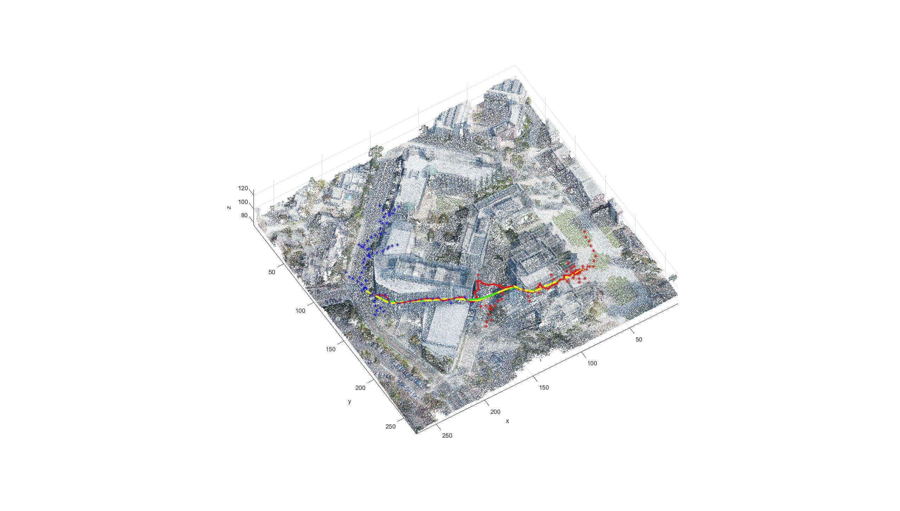
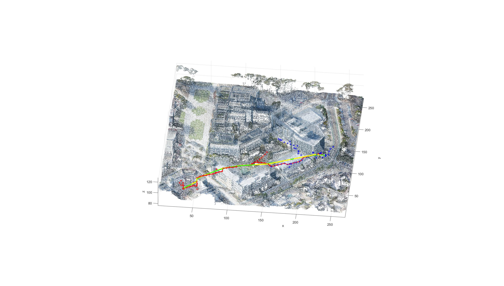
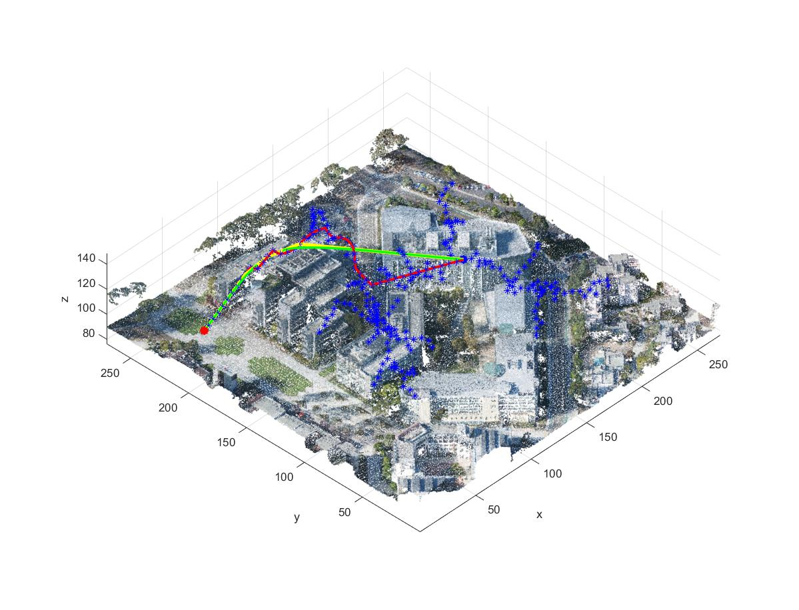
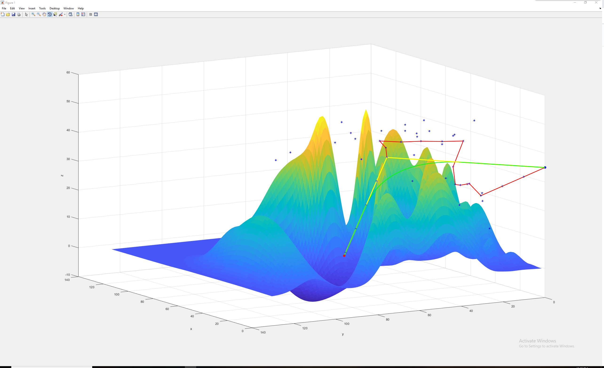
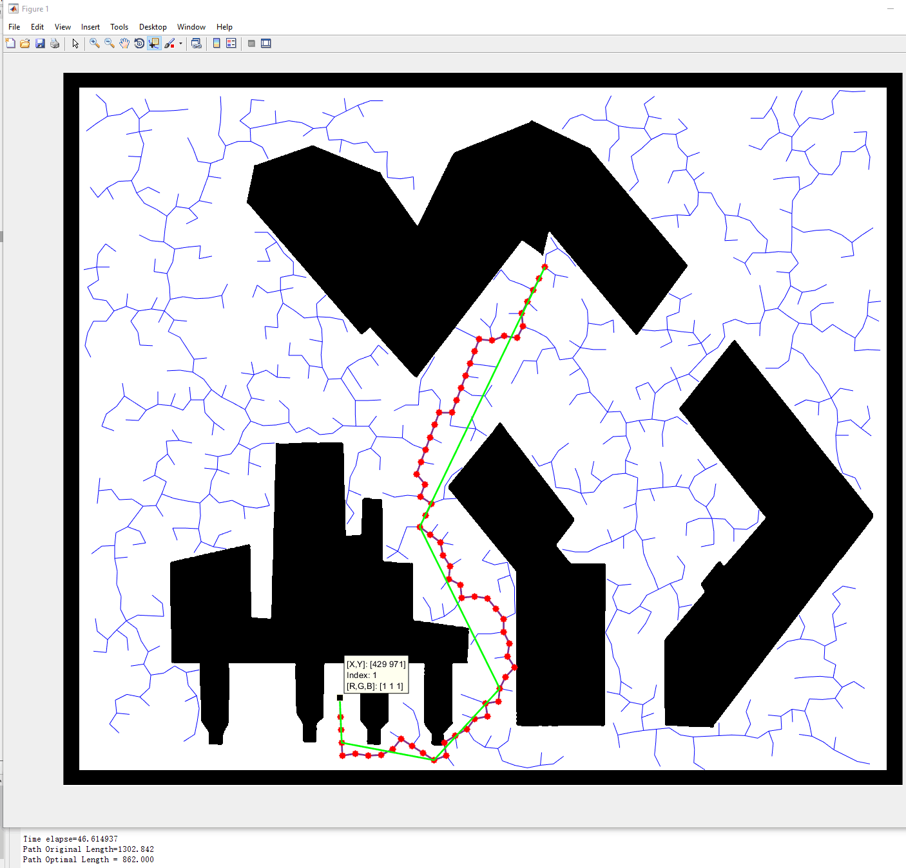
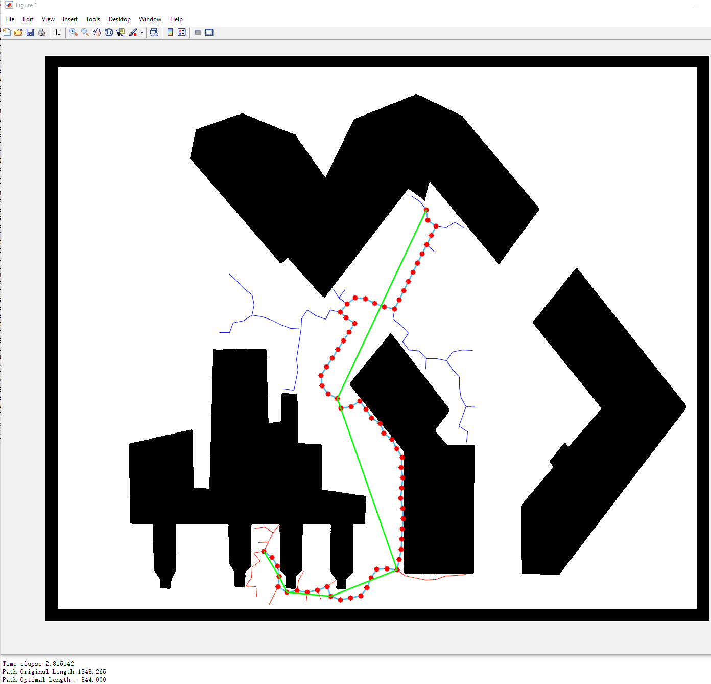

# Master-Graduate-Thesis

### Project Description:
While UAVs working on a new and sophisticated environment, the camera on the UAV could capture image of its surroundings and simultaneously transport back to the terminal computers. On the computers, by using SLAM algorithm, we could immediately build a 3D simulation gird or particle model. In this 3D model, we could pinpoint the exact target point that we want UAV to be. After that, the terminal computers send this info back to the processer on the UAV. With the auto-control algorithm on the processer, the UAV could intelligently design an optimal path and drive itself to the target point. 

### Video
https://youtu.be/DEHC7H58QWc
### Current progress:
1. Finished RRT (Rapidly-exploring Random Trees) algorithm for 2D map path planing.
2. Debugged and tested RRT.
3. Developed Bidirectional RRT in 2D maps.
4. Searching for other motion planning algorithms.
5. Implemented Bidirectional RRT in 3D point cloud maps.
6. Extracted the Point Cloud data from existing maps.
7. Solve the Collision Detection problem in Point Cloud maps.
8. Considering dynamic and kinematic UAV models. 

### Current results:
Bi-RRT in Point Cloud map:
  
   
Basic RRT in Point Cloud map:
  
RRT in 3D map:

Basic RRT:  
   
Bidirectional RRT:  

